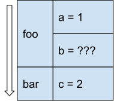
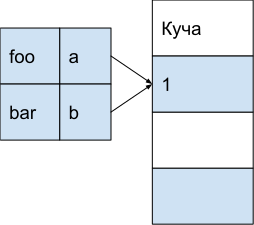
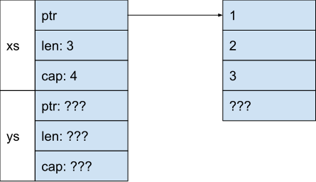
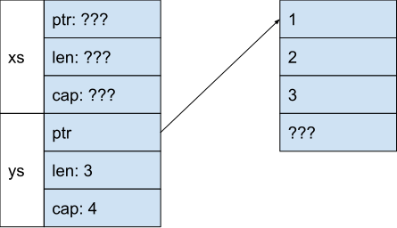
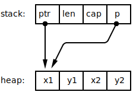
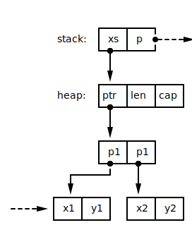

= Rust 2019
Алексей Кладов <aleksey.kladov@gmail.com>
:icons: font
:lecture: Лекция 1: Введение
:table-caption!:
:example-caption!:

[.centered]
== Про курс

- Научиться программировать на Rust?
- Устроиться на работу?

[.centered]
== Про курс

- Научиться думать о программах по-другому.
- Углубить понимание современного C++.

[.two-col]
== Про меня

- https://github.com/matklad
- IntelliJ Rust
- Cargo (система сборки Rust)
- rls 2.0 [.big]#😨#

--

{empty} +
{empty} +

--

[.two-col]
== Про Rust

--
image::../rust-logo-blk.svg[400,400]
--

* 1.0 в 2015 году
* нет сборщика мусора
* минимальный runtime
* конкурент {cpp}
* memory safety (!)

== Что такое Runtime?

runtime:: код "вокруг" вашей программы.

Типичные компоненты:

- сборщик мусора
- интерпретатор
- JIT компилятор
- представление значений в памяти

== Цена Runtime

Runtime это замечательно!

Чем больше делает runtime, тем меньше надо делать вам.

{empty} +
{empty} +

Но:

- скорость
- размер
- переиспользование

== Zero Cost Abstractions

Ключевой момент философии C++ и Rust:

NOTE: высокоуровневые конструкции бесплатны во время исполнения программы

Хорошая философия, когда **ресурсы ограничены**.

== Пример (Java)

[source,java]
----
private static double average(int[] data) {
    int sum = 0;
    for (int i = 0; i < data.length; i++) {
        sum += data[i];
    }
    return sum * 1.0d / data.length;
}
----

[source,sh]
----
$ java MainJ
30 ms
----

== Пример (Rust)

[source,rust]
----
fn average(xs: &[i32]) -> f64 {
    let mut sum: i32 = 0;
    for i in 0..xs.len() {
        sum += xs[i];
    }
    sum as f64 / xs.len() as f64
}
----

[source,sh]
----
$ ./target/release/avg
???
----

== Пример (Rust)

[source,rust]
----
fn average(xs: &[i32]) -> f64 {
    let mut sum: i32 = 0;
    for i in 0..xs.len() {
        sum += xs[i];
    }
    sum as f64 / xs.len() as f64
}
----

[source,sh]
----
$ ./target/release/avg
17 ms
----

== Пример (Scala)

[source,scala]
----
def average(x: Array[Int]): Double = {
  x.reduce(_ + _) * 1.0 / x.size
}
----

[source,sh]
----
$ scala MainS
518 ms
----

== Пример (и снова Rust)

[source,rust]
----
fn average(xs: &[i32]) -> f64 {
    xs.iter().fold(0, |x, y| x + y) as f64 / xs.len() as f64
}
----

[source,sh]
----
$ ./target/release/avg
18 ms
----

== Анализ

Java (30 ms) vs Rust (17 ms)::

Функция не аллоцирует объекты, единственная разница -- в генерации кода.

Java (30 ms) vs Scala (518 ms)::

Функции работают с объектами => боксинг.

Rust (17 ms) vs Rust (18 ms)::

Функция -- бесплатная абстракция.

== Зачем нужен Runtime?

- Автоматическое управление памятью -- огромная экономия времени программиста
- Закон Амдала -- время работы программы не важно, если 90% это IO
- Ручное управление памятью -- путь к катастрофическим ошибкам

NOTE: Последний пункт -- разница между C++ и Rust.

[.centered]
== Где используется Rust?

- браузеры: Servo и Firefox
- операционные системы: Fuschia
- криптовалюты: Parity, Exonum
- базы данных: TiKV

== Hello, world

[source,rust]
----
fn main() {
    println!("Hello, World!");
}
----

[source,sh]
----
$ rustc main.rs  # без оптимизаций
$ ./main
Hello, World!
----

== Hello, world

[source,rust]
----
#![no_main]

#[link_section=".text"]
#[no_mangle]
pub static main: [u32; 9] = [
    3237986353,
    3355442993,
    120950088,
    822083584,
    252621522,
    1699267333,
    745499756,
    1919899424,
    169960556,
];
----

== Hello, Cargo

TIP: https://rustup.rs/

[source,sh,subs="quotes"]
----
$ cargo new hello-world
    [.green]*Created* binary (application) \`hello-world` package
$ cargo run --release
   Compiling hello-world v0.1.0 (/home/matklad/hello-world)
    [.green]*Finished* release [optimized] target(s) in 0.50s
     [.green]*Running* \`target/release/hello-world`
Hello, world!
----

[.title-slide]
== Основные Типы

== Целые числа

|===
|кол-во бит| 8 | 16 | 32 | 64 | 128 | 32/64

|Знаковые|`i8`|`i16`|`i32`|`i64`|`i128`|`isize`
|Беззнаковые|`u8`|`u16`|`u32`|`u64`|`u128`|`usize`
|===

`usize` -- размер указателя

== Целые числа

- Литералы -- целое число + суффикс
+
[source,rust]
----
let y = 92_000_000i64;
let hex_octal_bin = 0xffff_ffff + 0o777 + 0b1;
let byte: u8 = b'a';
assert_eq!(byte, 65);
----

- Тип литерала без суффикса выводится из контекста
+
[source,rust]
----
let idx: usize = 92;
----

- По умолчанию -- `i32`
+
[source, rust]
----
let int = 92;
println!("{}", int);
----

== Арифметика

- арифметические операции: `+`, `-`, `*`, `/`
- `+/+`, `+%+` округляют к 0
- битовые/логические операции: `<<`, `>>`, `|`, `&`, `^`
- инверсия битов: `!`
- нет оператора возведения в степень
- нет `++`
- методы: [.language-rust]`(-92i32).abs()`, [.language-rust]`0b001100u8.count_ones()`

== Арифметика

Нет неявного приведения типов

[source,rust,subs="quotes"]
----
let x: u16 = 1;

[.hl-error]##let y: u32 = x;## // error: mismatched types

let y: u32 = x.into();  // Расширение без потери точности
let z: u16 = y as u16;  // Берём младшие биты

let to_usize = 92u64 as usize;
let from_usize = 92usize as u64;
----

- [.language-rust]`as` -- оператор явного приведения типов

== Арифметика

Переполнение -- ошибка программиста

[source,rust]
----
fn main() {
    let x = i32::max_value();
    let y = x + 1;
    println!("{}", y);
}
----

[source,sh]
----
$ cargo run
thread 'main' panicked at 'attempt to add with overflow', main.rs:3:13

$ cargo run --release
-2147483648
----

== Арифметика

Явная арифметика с переполнением

[source,rust]
----
let x = i32::max_value();

let y = x.wrapping_add(1);
assert_eq!(y, i32::min_value());

let y = x.saturating_add(1);
assert_eq!(y, i32::max_value());

let (y, overflowed) = x.overflowing_add(1);
assert!(overflowed);
assert_eq!(y, i32::min_value())

match x.checked_add(1) {
    Some(y) => unreachable!(),
    None => println!("overflowed"),
}
----

== Переполнение в C++

CAUTION: Переполнение **знакового** типа в C или C++ -- undefined behavior

.Что такое *неопределённое поведение*?
. Результат операции зависит от архитектуры?
. Результатом может быть любое число?
. Инструкция оптимизатору: "такого не может быть".

== !

.main.cpp
[source,cpp]
----
#include <climits>
#include <iostream>

bool will_overflow(int x) {
  return x > x + 1;
}

int main() {
  std::cout << will_overflow(INT_MAX) << std::endl;
}
----

[source,sh]
----
$ clang main.cpp -O0 && ./a.out
1
$ clang main.cpp -O2 && ./a.out
0
----

== With undefined behavior anything is possible

== Польза UB

[source,cpp]
----
for (int i = 0; i < m; ++i) {
    foo(xs[i]);
}
----

Оптимизация: замена индексации на указатели

[source,cpp]
----
for (T* it = &xs[0]; it < &xs[m]; ++it) {
    foo(*it);
}
----

Размер указателя -- 64 бита, размер `int` -- 32 бита.

Трансформация верна только если переполнение `int` не определено.

== UB в Rust

Ключевой момент философии Rust, и главное отличие от C++:

NOTE: Проверка типов гарантирует отсутствие UB^*^

Существуют [.language-rust]`unsafe` операции: компилятор не может проверить их
корректность, но требует явного блока `[.language-rust]#unsafe# { }`.

== Арифметика в стиле C++

[source,rust]
----
let x = 92;
let y = unsafe { x.unchecked_add(1) };
----

- такой функции пока нет
- программист обязан гарантировать отсутствие переполнения
- компилятор верит и использует при оптимизации
- коллеги программиста видят (pass:[<kbd>Ctrl+f</kbd>]) `unsafe`

== Числа с плавающей точкой (IEEE-754)

|===
|`f32`|`f64`
|===

[source,rust,subs="quotes"]
----
let y = 0.0f32;    // литерал f32
let x = 0.0;       // тип выводится, f64 по умолчанию

// точка обязательна
[.hl-error]#let z: f32 = 0;#    // error: expected f32, found integer variable
let z: f32 = 0.0;

let not_a_number: f32 = std::f32::NAN;
let inf: f32 = std::f32::INFINITY;

// есть куча методов
8.5f32.ceil().sin().round().sqrt()
----

== Логический тип

[source,rust]
----
let to_be: bool = true;
let not_to_be = !to_be;
let the_question = to_be || not_to_be;
----

* `&&` и `||` "`ленивые`"
* нет неявного приведения к `bool`
+
[source,rust]
----
let i = 1;
let b: bool = i == 0;
let i = b as i32;
----

// 1 байт, потому что `*const bool`

== Кортежи

[cols="2*,2"]
|===
|`()`|`(i32,)`|`(i32, i64)`
|===

[source,rust]
----
let pair: (f32, i32) = (0.0, 92);
let (x, y) = pair;
let x = pair.0;
let y = pair.1;

let void_result = println!("hello");
assert_eq!(void_result, ());

let trailing_comma = (
    "Archibald",
    "Buttle",
);
----

== Кортежи

В памяти `(i32, i32)` это пара интов (8 байт):
|===
|`7`| `07 00 00 00`
|`(7, 263)`| `07 00 00 00 07 01 00 00`
|===

Объединение типов в кортеж -- zero cost abstraction.footnote:[Паддинг.]

== Кортежи

.main.rs
[source,rust]
----
fn main() {
    let t = (92,);
    println!("{:?}", &t as *const (i32,));  // 0x7ffc6b2f6aa4
    println!("{:?}", &t.0 as *const i32);   // 0x7ffc6b2f6aa4
}
----

.main.py
[source,python]
----
t = (92,)
print(id(t))     # 139736506707248
print(id(t[0]))  # 139736504680928
----

== Массивы

[cols="2,2,3"]
|===
|`[i32; 0]`|`[i32; 1]`|`[i32; 10]`
|===

NOTE: размер массива -- константа, часть типа

`[i8; 3]` это примерно то же самое, что и `(u8, u8, u8)`.

[source,rust]
----
let xs: [u8; 3] = [1, 2, 3];
assert_eq!(xs[0], 1);    // index -- usize
assert_eq!(xs.len(), 3); // len() -- usize

let mut buf = [0u8; 1024];
----

== Ссылки

|===
|`&T`| [.language-rust]`&mut T`
|===

- подробности -- в следующей лекции
- представление ссылки -- указатель
- не может быть `NULL`
- гарантирует, что объект жив

[source,rust]
----
let mut x: i32 = 92;
let r: &mut i32 = &mut 92; // явное взятие ссылки
*r += 1;                   // явное разыменовывание ссылки
----

== Указатели

|===
|[.language-rust]`*const T`| [.language-rust]`*mut T`
|===

- могут быть `NULL`
- **не** гарантируют, что объект жив
- разыменовывание указателя -- [.language-rust]`unsafe` операция
- встречаются редко (ffi и продвинутые структуры данных)

== Box

|===
|`Box<T>`
|===

- указатель на данные в куче
- не может быть `NULL`
- `Box::new` выделяет память
- память освобождается на выходе из области видимости
- Для любителей C++: `std::unique_ptr`

[source,rust]
----
let x: Box<i32> = Box::new(92);
----

== Стек

[.two-col]
--

[source,rust]
----
fn foo() {
    let a = 1;
    let b = bar();
}

fn bar() -> i32 {
    let c = 2;
    92
}
----

--

== Куча

[.two-col]
--

[source,rust]
----
fn foo() {
    let a: Box<i32>;
    a = Box::new(1);
    bar(&*a)
}

fn bar(b: &i32) {
}
----

--

== !

.Стек
- быстро: сложить два числа
- автоматическое освобождение
- время жизни привязано к функции
- размер известен во время компиляции

.Куча
- медленнее: `insert`/`remove` в дереве, синхронизация
- явные `malloc` и `free`
- произвольное время жизни
- любой размер

== !

.Стек
- локален для потока
- адресное пространство выделяется при старте потока (8mb)
- маппинг в физическую память ленивый
- если _очень_ хочется, можно поменять после старта потока
- guard page

.Куча
- глобальна для процесса
- `mmap`, `brk` для выделения адресного пространства
- аллокатор для распределения памяти

== Как узнать, когда можно делать `free`?

Сборка мусора::
_Динамически_ считаем живые указатели на объекты, освобождаем недостижимую память.
{empty} +
{empty} +
https://www.cs.virginia.edu/~cs415/reading/bacon-garbage.pdf[Unified theory of grabage collection]

Rust::
_Статически_ освобождаем память в фиксированном месте, запрещаем убегающие указатели.
{empty} +
{empty} +
RAII? Статическая сборка мусора? Счётчик ссылок в **F~2~**?

== !

[source,rust]
----
fn foo() {
    let x = Box::new(92); // вызов alloc
    let r: &i32 = &x;
    use_x(r);
                          // неявный вызов dealloc
}

fn use_x(x: &i32) {
}
----

Память освобождается при выходе из области видимости (`{}`)

== !

[source,rust,subs="quotes"]
----
fn foo() {
    let r: &i32;
    {
        let x = Box::new(92);
        r = &*x;
    }

    use_x(r);
}

fn use_x(x: &i32) {
}
----

== !

[source,rust,subs="quotes"]
----
fn foo() {
    let r: &i32;
    {
        let x = Box::new(92);
        r = [.hl-error]##&*x##; // borrowed value does not live long enough
    }

    use_x(r);
}

fn use_x(x: &i32) {
}
----

== Проблема

[source,rust]
----
fn foo() {
    let x = Box::new(92);
    let y = x;
}
----

Если память освобождается на выходе из блока, то мы освободим её дважды?

== Присваивание (move)

Компилятор поддерживает множество инициализированных переменных, присваивание
"тратит" правую часть

[source,rust]
----
                        // init              uninit
let y;                  //                   y
let x;                  //                   x, y
let x = Box::new(92);   // x                 y
let t = x;              // t                 x, y
let y = t;              // y                 x, t
// y освобождает память
----

при-сво-ить::
завладеть, самовольно взять в свою собственность, выдать за своё.

[.centered]
== Примеры

.use after move
====
[source,rust,subs="quotes"]
----
let spam = Box::new(92);
let eggs = spam;
println!("{}", [.hl-error]#spam#); // use of moved value spam
----
====

[.centered]
== Примеры

.вызов функции
====
[source,rust]
----
fn foo() {
    let x = Box::new(92); // alloc
    bar(x);
    // x тут не  определён
}

fn bar(x: Box<i32>) {
    // dealloc
}
----
====

== drop

Вызов функции это move: напишем удалятор переменных

[source,rust]
----
fn drop<T>(_value: T) {
}

fn foo() {
    let x = Box::new(1);
    let y = Box::new(2);
    drop(y);
    drop(x);
}
----

Функция `drop` доступна из коробки

== Аффинные типы

[subs="quotes"]
----
let x: T = foo() in
if *condition*
    then *then_branch*
    else *else_branch*
----

Обычная типизация::
`*condition*`, `*then_branch*`, `*else_branch*` могут использовать `x`

Линейная типизация::
нужно использовать `x` ровно один раз.

Аффинная типизация::
можно использовать `x`, но не более одного раза.

== Аффинные типы

`let [.hl-kw]#x# = 92 in`
[cols="m,d",frame=topbot,grid=rows]
|===
|if [.hl-kw]#x# > 0 then [.hl-kw]#x# else -[.hl-kw]#x#
|только обычная типизация

|if [.hl-kw]#x# > 0 then y else  z
|все три варианта

|if y > 0 then [.hl-kw]#x# else -[.hl-kw]#x#
|все три варианта

|if y > 0 then [.hl-kw]#x# else  z
|афинная, но не линейная
|===

[.centered]
== Обычные типы

[.text-center.big]
[subs="quotes"]
----
Г ⊢ t~1~: T~11~→T~12~   Г ⊢ t~2~: T~11~
━━━━━━━━━━━━━━━━━━━━━━━━━━━━
Г ⊢ t~1~ t~2~: T~12~
----

[.invisible]
--
NOTE: строим разбиение контекста для проверки подвыражений
--

[.centered]
== Афинные типы

[.text-center.big]
[subs="quotes"]
----
Г~1~ ⊢ t~1~: T~11~→T~12~   Г~2~ ⊢ t~2~: T~11~   Г = Г~1~ ⊔ Г~2~
━━━━━━━━━━━━━━━━━━━━━━━━━━━━━━━━━━━━━━━━━━━━
Г ⊢ t~1~ t~2~: T~12~
----

NOTE: строим разбиение контекста для проверки подвыражений

== Проблема

А что если присваиваем в зависимости от условия?

[source,rust]
----
let x = Box::new(92);
let y;
let z;
if condition {
    y = x;
} else {
    z = x;
}
// Кто освобождает память, x или y?
----

== Drop flags

А что если присваиваем в зависимости от условия?

[source,rust]
----
let x = Box::new(92);
let y;
let z;
if condition {
    y = x;
} else {
    z = x;
}
// Кто освобождает память, x или y?
----

Невидимый флаг _на стеке_: инициализирована ли переменная?

Очень маленький счётчик ссылок :o)

== Vec

|===
|`Vec<T>`
|===

- расширяющийся массив
- `Box` для `n` элементов

[source,rust]
----
pub struct Vec<T> {
    /// Указатель на данные в куче.
    ptr: *const T,
    /// Количество элементов в векторе.
    /// Инвариант: len <= capacity.
    len: usize,
    /// Количество слотов в векторе (capacity).
    /// Увеличивается в 2 раза при заполнении.
    cap: usize,
}
----

== Vec

[source,rust]
----
use std::mem::size_of;
assert_eq!(
    size_of::<Vec<i32>>(),
    size_of::<usize>() * 3,
);

let mut xs = vec![1, 2, 3];
xs.push(4);
assert_eq!(xs.len(), 4);
assert_eq!(xs[2], 3);
----

== Vec

[source,rust]
----
let ys;
let xs = vec![1, 2, 3];
ys = xs;
----

== Vec

[source,rust]
----
let ys;
let xs = vec![1, 2, 3];
ys = xs;
----

== Vec

[source,rust]
----
let ys;
let xs = vec![1, 2, 3];
ys = xs.clone();
----

image::vec3.svg[width=700]

== Виды присваивания

[source]
----
xs = ys
----

- Python: увеличим счётчик ссылок.
- Java: копируем указатель, сборщик мусора на него посмотрит потом
  (+ опциональный барьер).
- C++: делаем глубокую копию объекта.
- Rust: в compile-time пометим `ys` как неинициализированную, в runtime
  скопируем байты на стеке.

== !

.Rust
- move это `memcpy` `size_of::<T>` байт
- есть всегда, не может завершиться с ошибкой
- поведение по умолчанию
- копирование -- явный вызов `.clone`

.{cpp}
- можно перегрузить move конструктор
- есть не всегда, может кинуть исключение
- по умолчанию -- копирование (за исключением rvalue-ссылок)
- **совместимость с C++98**

== Представление объектов в памяти

* CPU существенно быстрее RAM
* кэш существенно меньше и быстрее RAM
* разыменовывание указателя -- дорогая операция
* компилятор может сгенерировать эффективный код
* компилятор **не** может поменять структуру данных

[.two-col]
== Rust/{cpp}

[source,rust]
----
struct Point { x: f64, y: f64}

let xs: Vec<Point> = ...;
let p: &Point = xs[0];
----

--

--

[.two-col]
== Java

[source,java,subs="quotes"]
----
[.hl-kw]#class# Point {
    double x;
    double y;
}

ArrayList<Point> xs = ...;
Point p = xs.get(0);
----

--

--

