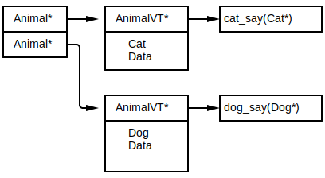
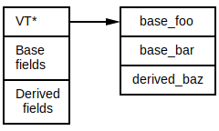
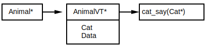
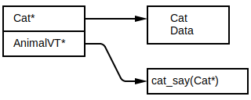

= Rust 2019
Алексей Кладов <aleksey.kladov@gmail.com>
:icons: font
:lecture: Лекция 7: Объекты, строки
:table-caption!:
:example-caption!:

[.title-slide]
== impl Trait

== Как вернуть итератор?

[source,rust]
----
fn random(n: usize) -> Vec<u32> {
    let mut r = 92;
    std::iter::repeat_with(move || {
        r ^= r << 13;
        r ^= r >> 17;
        r ^= r << 5;
        r
    }).take(n).collect()
}
----

* не гибко -- аллоцируем `Vec`

== Как вернуть итератор?

[source,rust]
----
fn random<T: FromIterator<u32>>(n: usize) -> T {
    let mut r = 92;
    std::iter::repeat_with(move || {
        r ^= r << 13;
        r ^= r >> 17;
        r ^= r << 5;
        r
    }).take(n).collect()
}
----

* лучше, но всё равно не удобно, не хочется думать про `n`

== Как вернуть итератор?

[source,rust]
----
fn random() -> ??? {
    let mut r = 92;
    std::iter::repeat_with(move || {
        r ^= r << 13;
        r ^= r >> 17;
        r ^= r << 5;
        r
    })
}
----

* написать конкретный тип не можем из-за лямбды
* написать `+-> Iterator<Item = u32>+` не получится --  +
`Iterator` это не тип

== Попытка 1

[source,rust]
----
fn random<T: Iterator<Item = u32>>() -> T {
    let mut r = 92;
    std::iter::repeat_with(move || {
        r ^= r << 13;
        r ^= r >> 17;
        r ^= r << 5;
        r
    })
}
----

== Попытка 1

* не работает: вызывающий код выбирает тип `T`:
+
[source,rust]
----
struct MyIter;
impl Iterator for MyIter { type Item = u32; ...  }

fn main() {
    let _ = random::<MyIter>();
}
----

* "я могу вернуть **любой** `T` для котого верно +
  ``T: Iterator<Item = u32>``"

* нужно "**существует** какой-то ``T: Iterator<Item = u32>``"

== impl Trait

[source,rust]
----
fn random() -> impl Iterator<Item = u32> {
    let mut r = 92;
    std::iter::repeat_with(move || {
        r ^= r << 13;
        r ^= r >> 17;
        r ^= r << 5;
        r
    })
}
----

* [.language-rust]`+-> impl Trait+` не тип, синтаксис для ограниченного вывода типов (`+-> auto+` нет)
* генератор машинного кода знает конкретный тип, но вывод типов знает только про `: Trait`
* нельзя использовать в качестве типа поля

== impl Trait

[.language-rust]`impl Trait` можно использовать для аргументов, в качестве сахара для типовых параметров

[source,rust]
----
fn process(items: impl Iterator<Item = Foo>) {

}

fn process<I: Iterator<Item = Foo>>(items: I) {

}
----

* аргумент: *forall*
* возвращаемое значение: *exists*

[.title-slide]
== dyn Trait

== !

[source,rust]
----
trait Say {
    fn say(&self);
}

impl Say for Cat { ... }
impl Say for Dog { ... }

fn main() {
    let mut animals = Vec::new();
    animals.push(Cat::new("Garfield"));
    animals.push(Dog::new("The Hound of the Baskervilles"));
    for animal in animals.iter() {
        animal.say();
    }
}
----

* нельзя сложить `Cat` и `Dog` в вектор -- разный тип и размер
* частично решили проблему в случае с функциями

== Таблица Виртуальных Функций

В Java работает, потому что и `Cat`, и `Dog` -- указатели:

== Таблица Виртуальных Функций

Объяснение на пальцах:

Таблица вируальных функций -- структура из указателей на функции. Функции
наследников записываются в конец.

[.centered]
== Таблица Виртуальных Функций

[NOTE.question]
Как выглядит таблица виртуальных функций для класса с несколькими интерфейсами?

https://lukasatkinson.de/2018/interface-dispatch/
https://wiki.openjdk.java.net/display/HotSpot/VirtualCalls
https://wiki.openjdk.java.net/display/HotSpot/InterfaceCalls

== Интерфейсы в C++

Внутри каждого объекта -- несколько `vtable*` (по одной на каждый интерфейс).

Каст `Derived*` к `Base*` это coercion, значение указателя меняется.

Следствие: +
Нельзя привести `vector<Derived*>` к `vector<Base*>`

== Интерфейсы в Java

В Java, `List<Derived>` *можно* привести к `List<Base>`.

Вместо VTable -- указатель на класс. В классе -- список VTableов для каждого
интерфейса. Для вызова метода интерфейса надо честно найти нужный интерфейс в
списке.

NOTE: JIT оптимистически всё инлайнит

== thin pointer

VTable можно сложить в объект (C++, C#, Java):

== fat pointer

Но можно положить и рядом с указателем (Rust, Go):

== !

[.language-rust]`dyn Trait`, trait object::
Толстый указатель: пара из указателя на данные и указателя на таблицу виртуальных функций

[source,rust]
----
trait Say {
    fn say(&self);
}

fn main() {
    let cat: Cat = Cat::new("Garfield");
    let cat: &dyn Say = &cat;
    let dog: Dog = Dog::new("The Hound of the Baskervilles");
    let dog: &dyn Say = &dog;
    let animals = vec![cat, dog];
    for animal in animals.iter() {
        animal.say();
    }
}
----

== !

[source,rust]
----
trait Say {
    fn say(&self);
}

impl Say for i32 {
    fn say(&self) {
        println!("hm... int-int?")
    }
}

fn main() {
    let i: i32 = 92;
    let i: &dyn Say = &i;
    let animals = vec![i];
    for animal in animals.iter() {
        animal.say();
    }
}
----

[.centered]
== !

.Замыкания часто используются с [.language-rust]`dyn Trait`:
[source,rust]
----
type Callback = Box<dyn Fn(u32) -> u32>;

fn adder(x: u32) -> Callback {
    Box::new(move |y| x + y)
}

fn multiplier(x: u32) -> Callback {
    Box::new(move |y| x * y)
}
----

[.language-rust]`+Box<dyn Fn(T) -> U>+` -- аналог `std::function`

== dyn Trait

Трейты механизм и статического, и динамического полиморфизма

Dynamic dispatch работает для чужих типов

.[.language-rust]`dyn Trait` можно использовать с любым указателем:
[source]
----
size_of::<&dyn Say>()
  == size_of::<Box<dyn Say>>()
  == size_of::<*const dyn Say>()
  == size_of::<usize>() * 2
----

== Dynamically Sized Types

`[T]` и [.language-rust]`dyn Trait` это примеры DST: размер объекта не
определяется статически. Обращение к DST -- через толстый указатель.

Для не DST типов верно `: Sized`. Типовые параметры по умолчанию `Sized`

.`std::mem`
[source,rust,subs=+quotes]
----
fn size_of<T>() -> usize                 // неявный where T: Sized
fn size_of_val<T: ##?Sized##>(val: &T) -> usize // убрали ^
----

== Dynamically Sized Types

[source,rust]
----
pub trait Index<Idx: ?Sized> {
    type Output: ?Sized;

    fn index(&self, index: Idx) -> &Self::Output;
}

impl<T> Index<Range<usize>> for [T] {
    type Output = [T]; // unsized!
    fn index(&self, index: I) -> &[T]
}
----

CAUTION: на слайдах предыдущих лекций я не писал `: ?Sized`

== Object Safety

Не из каждого трейта можно приготовить trait object

.Нельзя возвращать/принимать `Self` по значению:
[source,rust]
----
trait Clone {
    fn clone(&self) -> Self;
}
----

.Нельзя использовать ассоциированные функции:
[source,rust]
----
trait Default {
    fn default() -> Self;
}
----

.Нельзя использовать параметризованные методы:
[source,rust]
----
trait Hash {
    fn hash<H: Hasher>(&self, state: &mut H)
}
----

== Когда Self: Sized

[source,rust]
----
trait ObjectSafe {
    fn ok(&self);

    fn generic<T>(&self, t: T)
        where Self: Sized;

    fn bad_self() -> Self
        where Self: Sized;
}

fn foo(obj: &dyn ObjectSafe) {
    obj.ok();
    // the `generic` method cannot be invoked on a trait object
    // obj.generic::<i32>(92)
}
----

Только не `Self: Sized` методы определяют object safety

== Iterator

[source,rust]
----
trait Iterator {
    type Item;
    fn next(&mut self) -> Option<Self::Item>; // object safe

    fn map<B, F>(self, f: F) -> Map<Self, F> // object safe!
        where Self: Sized, F: FnMut(Self::Item) -> B,
    { Map { iter: self, f } }

    ...
}
----

Из итератора можно сделать [.language-rust]`Box<dyn Iterator<Item = T>>`, аналог `Iterator<E>` из Java. Цена: аллокация в куче и dynamic dispatch на внешнем слое.

== Iterator

[source,rust]
----
fn with_any_iterator(it: &mut dyn Iterator<Item = u32>) {
    let first = it.next(); // ok, next is object safe
    let it = it.filter(|it| it > 100) // ???
}
----

На [.language-rust]`dyn Iterator` можно позвать `.next`, но не понятно, что
делать с комбинаторами:

[source,rust]
----
fn filter_map<B, F>(self, f: F) -> FilterMap<Self, F>
    where Self: Sized, F: FnMut(Self::Item) -> Option<B>,
{ FilterMap { iter: self, f } }
----

Наш Self это [.language-rust]`&mut dyn Iterator`

== Iterator

[source,rust]
----
impl<I: Iterator + ?Sized> Iterator for &mut I {
    type Item = I::Item;
    fn next(&mut self) -> Option<I::Item> { (
        **self).next()
    }
    fn size_hint(&self) -> (usize, Option<usize>) {
        (**self).size_hint()
    }
    fn nth(&mut self, n: usize) -> Option<Self::Item> {
        (**self).nth(n)
    }
}
----

[.language-rust]`dyn Iterator` это `: Iterator` => +
[.language-rust]`&mut dyn Iterator` -- тоже `: Iterator`

== Философия

Dynamic dispatch -- мощный инструмент, вызов не известного кода

Отлично подходит для плагинов, но затрудняет понимание кода

Нарушает inline, требует косвенности => не супер быстрый

В целом, [.language-rust]`dyn Trait` используется редко

[.title-slide]
== Строки

== std::fmt::Debug и std::fmt::Display

Трейты `Debug` и `Display` используются для превращения объектов в строки.

[source,rust]
----
let text = "hello\nworld ";
println!("{}", text);   // Display
println!("{:?}", text); // Debug
----

[source, sh]
----
$ ./main
hello
world
"hello\nworld "
----

`Display` для пользователя =
`Debug` для программиста

== !

[source,rust]
----
#[derive(Debug)] // Debug можно реализовать автоматически
struct Foo {
    x: i32
}

fn main() {
    let xs = vec![Foo { x: 1 }, Foo { x: 2 }],
    eprintln!("{:?}", xs);
    eprintln!("{:#?}", xs); // # включает альтернативный формат
}
----

[source]
----
$ ./main
[Foo { x: 1 }, Foo { x: 2 }]
[
    Foo {
        x: 1
    },
    Foo {
        x: 2
    }
]
----

== Дизайн

[source,rust]
----
trait Display {
    fn fmt(&self, f: &mut fmt::Formatter) -> fmt::Result;
}
----

.Возвращать `String` плохо:
* если выводим сразу в файл, то ненужная аллокация
* можно выводить в буфер на стеке ограниченного размера
* `N` отдельных аллокаций для подобъектов

== Дизайн

.Formatter абстрагирует назначение:
[source,rust]
----
pub struct Formatter<'a> {
    flags: u32,
    fill: char,
    align: rt::v1::Alignment,
    width: Option<usize>,
    precision: Option<usize>,

    buf: &'a mut (dyn Write+'a), // trait object / NVI
    curarg: slice::Iter<'a, ArgumentV1<'a>>,
    args: &'a [ArgumentV1<'a>],
}

impl<'a> Formatter<'a> {
    fn write_str(&mut self, data: &str) -> fmt::Result;
    ...
}
----

== ToString

[source,rust]
----
pub trait ToString { <1>
    fn to_string(&self) -> String;
}

impl<T: fmt::Display + ?Sized> ToString for T {
    fn to_string(&self) -> String {
        use core::fmt::Write;
        let mut buf = String::new();
        buf.write_fmt(format_args!("{}", self)) <2>
           .expect("Display returned an error unexpectedly");
        buf.shrink_to_fit();
        buf
    }
}
----

<1> `ToString` -- чтобы можно было позвать `.to_string`
<2> `format_args`: компилирует шаблон строки

== String

.Строки в Rust устроены просто:
[source,rust]
----
pub struct String {
    vec: Vec<u8>,
}
----

Вектор байт + **инвариант**, что в байтах валидный UTF-8

== UTF-8

Variable length encoding, совместима с ASCII, 1 байт для latin-1

[source]
----
a  : 0x61
ы  : 0xd1 0x8b
😀 : 0xf0 0x9f 0x98 0x80
----

UTF-8 -- кодировка по умолчанию в современных системах

WARNING: нет random access доступа к символу (в целом не понятно, что такое символ)

== UCS-2 / UTF-16

В 1991 году думали, что 65536 символов хватит всем: UCS-2 это fixed width (16
бит) кодировка с random access.

Много систем изначально использовали UCS-2 (Java, Windows, JavaScript).

В 1996 UCS-2 расширили до `UTF-16`: пара суррогатных символов кодирует один code point вне BMP.

`UTF-16` -- тоже variable length, не random access.

Многие языки используют UTF-16 с API UCS-2: можно получить невалидные данные в стоке.

== API

[source,rust]
----
impl String {
    fn new() -> String;
    fn with_capacity(capacity: usize) -> String; <1>
    fn from_utf8(vec: Vec<u8>) -> Result<String, FromUtf8Error>; <2>
    fn from_utf16(v: &[u16]) -> Result<String, FromUtf16Error>; <3>
    fn into_bytes(self) -> Vec<u8>;
}

impl FromUtf8Error {
    fn into_bytes(self) -> Vec<u8>; <4>
}
----

<1> строки изменяемые (если у вас есть [.language-rust]`&mut`)
<2> конверсия из UTF-8 не копирует
<3> конверсия из UTF-6 копирует
<4> в случае ошибки можно получить свой вектор назад

== str

`str` -- DST, `[u8]` + utf-8 инвариант. +
`&str` -- указатель на байты + размер, неизменяемая строка

[source,rust]
----
impl Deref for String {
    type Target = str;
    ...
}

impl Index<Range<usize>> for String {
    type Output = str;
}
----

`&str` можно получить из `String` через  слайс: `&s[1..10]`

Индексы для стайса -- позиции в байтах +
Если позиция приходится на середину символа -- паника

== Строки Без Копирования

[source,rust]
----
impl str {
    fn split_whitespace<'a>(&'a self) -> SplitWhitespace<'a>;
}

impl<'a> Iterator for SplitWhitespace<'a> {
    type Item = &'a str;
    ...
}
----

Многие методы на `&String`  `&str` возвращают `&str` -- zero copy

В отличие от старой Java и JavaScript нельзя получить memory leak: lifetime
`&str` привязан к `String`

== char

|===
char
|===

Примитивный тип для хранения Unicode Codepoint, 32 бита

Используется редко: единица текста это grapheme cluster

.API знает про Unicode:
[source,rust]
----
impl char {
    to_lowercase(self) -> ToLowercase; // итератор!
}

impl Iterator for ToLowercase {
    type Item = char;
}
----

== API

[source,rust]
----
impl str {
    fn chars(&self) -> Char; // итератор charов

    fn to_ascii_lowercase(&self) -> String;
    fn make_ascii_uppercase(&mut self);

    // нельзя обойтись без аллокации
    fn to_lowercase(&self) -> String;

    // индекс в байтах, можно использовать в `[]`
    pub fn find<'a, P>(&'a self, pat: P) -> Option<usize>
        where P: Pattern<'a>;
    fn is_char_boundary(&self, index: usize) -> bool;

    fn as_bytes(&self) -> &[u8];
}

// std::str
pub fn from_utf8(v: &[u8]) -> Result<&str, Utf8Error>;
----

== Цена Абстракции

В Rust есть два представления для последовательностей:

. слайсы: `[T]`, `str`
. итераторы: `Iterator<Item = T>`

В теории, должно хватать только итераторов

На практике, знание о том, что объекты лежат в памяти последовательно, позволяет
значительно ускорить многие низкоуровневые операции (`memcpy`, `memchr`, etc).

== CString / CStr

Многие FFI строки используют `char *` -- байты, терминированные `0`

`String` и `str` не совместимы с `char *`: нет нулевого байта в конце, нет
гарантии про utf-8

`CString` -- обёртка над `char *` для FFI

WARNING: чтобы превратить `String` в `CString` нужна аллокация

== OsString / OsStr

* строки в Unix -- последовательность ненулевых байтов
* строки в Windows -- "UTF-16" с непарными суррогатами

`OsString` может представить любую строку ОС. Внутреннее представление -- WTF-8
(надмножество Unicode для представления невалидный строк)

`String` это `OsString`, `str` это `OsStr`

== PathBuf / Path

`PathBuf` обёртка над `OsString` для работы с путями

Интерпретирует `/`, `\` как сепараторы + куча полезных методов

NOTE: На windows `/` работает в качестве сепаратора

== Итоги

Строк много. Любая строка -- вектор байт, отличие в инвариантах

|===
|owned|String|CString|OsString|PathBuf
|borrowed|str|CStr|OsStr|Path
|===

`Os` и `C` варианты -- редкие

UTF-8 + байтовые индексы -- эффективное низкоуровневое представление
