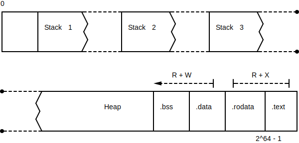
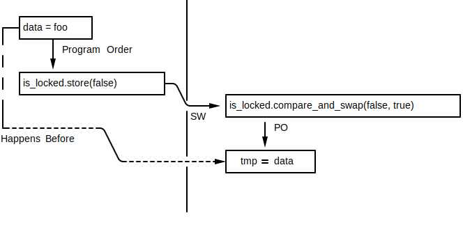

= Rust 2019
Алексей Кладов <aleksey.kladov@gmail.com>
:icons: font
:lecture: Лекция 10: Многопоточность
:table-caption!:
:example-caption!:

[.title-slide]
== Потоки

== Ликбез

Процесс::

Набор ресурсов операционной системы (адресное пространство, файловые
дескрипторы, etc)

Поток::
Поток управления в рамках одного процесса (стэк + instruction pointer)

TIP: Два потока в одном процессе разделяют адресное
пространство, разные процессы полностью изолированы

== !

* buffer overflow перетирает стэк, а не пустое пространство
* куча -- общая на все потоки
* .data -- [.language-rust]`static`, .rodata -- [.language-rust]`const`
* .bss -- для [.language-rust]`static`, инициализированных нулём

== Создание потока

[source,rust]
----
include::code/spawn.rs[]
----

<1> запускаем поток, передавая замыкание
<2> ждём завершения потока

NOTE: Если созданный поток запаниковал, то результат `join` -- `Err`

== Thread Builder

В Rust нет ни overloading (сложный вывод типов), ни именованных параметров (не
успели к 1.0), используется builder pattern

[source,rust]
----
include::code/spawn_builder.rs[]
----

== !

[source,rust]
----
pub struct Builder {
    name: Option<String>,
    stack_size: Option<usize>,
}

impl Builder {
    pub fn new() -> Builder {
        Builder { name: None, stack_size: None }
    }

    pub fn name(mut self, name: String) -> Builder {
        self.name = Some(name);
        self
    }

    pub fn stack_size(mut self, size: usize) -> Builder {
        self.stack_size = Some(size);
        self
    }
}
----

== spawn

[source,rust]
----
fn spawn<F, T>(f: F) -> JoinHandle<T> where
    F: FnOnce() -> T,
    F: 'static,
    T: 'static,
----

По умолчанию, создаётся detached поток, который может пережить родительскую
функцию, если это не `main`

`spawn` требует от замыкания и результата [.language-rust]`'static`

Нельзя случайно захватить локальную переменную +
=> использование потоков не приведёт к use after free

[.centered]
== spawn

[source,rust,subs="+quotes"]
----
fn foo() {
    let x = 92;
    std::thread::spawn([.hl-error]##||## { // closure may outlive the current
        println!("{}", x);  // function, but it borrows x, which
    });                     // is owned by the current  function
}
----

[.centered]
== spawn

[source,rust,subs="+quotes"]
----
include::code/spawn_move.rs[]
----

[.centered]
== spawn

В C++ необходимо **явно** позвать `.detach` или `.join` (по умолчанию -- `abort`
в деструкторе), потому что `.detach` и лямбды могут легко привести к use after free.

== scope

А что если явно дождаться завершения потока?

[source,rust,subs="+quotes"]
----
fn foo() {
    let x = 92;
    let thread = std::thread::spawn(|| {
        println!("{}", x);
    });
    thread.join().unwrap();
}
----

Система типов не позволяет "`увидеть`", что мы зовём `.join` и убрать требование
про [.language-rust]`'static`

[.centered]
== thread::scoped

Давайте изобретём API, которое гарантирует, что поток будет присоединён!

== Drop

Мысль 1: присоединение в `Drop`

[source,rust]
----
fn scoped<'a, F>(f: F) -> JoinGuard<'a, T>
where
    F: FnOnce() -> T,
    F: 'a,
    T: 'a,

impl<'a, T> Drop for JoinGuard<'a, T> {
    fn drop(&mut self) {
        let _ = self.inner.join();
    }
}
----

== Drop

Так как `JoinGuard` параметризован [.language-rust]`'a`, не получится его утечь
за блок. Победа?

[source,rust,subs="+quotes"]
----
fn foo() -> JoinGuard<???, ()> {
    let x = 92;
    let thread = scoped(|| {
        println!("{}", x);
    });
    return thread;
}
----

== mem::forget

К сожалению, не работает: нет гарантии, что деструкторы вызываются

[source,rust,subs="+quotes"]
----
fn foo() {
    let x = 92;
    let thread = scoped(|| {
        println!("{}", x);
    });
    std::mem::forget(thread);
}
----

== Leakpocalypse Now!

`thread::scoped` добавили в стандартную библиотеку в 1.2 и убрали в 1.3.

* не было понимания, что не вызов деструктора -- валидное поведение (подробности
-- в лекции про [.language-rust]`unsafe`)
* писать [.language-rust]`unsafe` код сложно, даже разработчики stdlib делают
ошибки

== Closure Scope

Для гарантированного контроля за областью видимости используют паттерн с замыканием:

[source,rust]
----
include::code/scope.rs[]
----

<1> важно использовать RAII, чтобы `Cleanup` сработал при панике!

== crossbeam

.Cargo.toml:
[source]
----
[dependencies]
crossbeam = "0.7.1"
----

.main.rs:
[source,rust]
----
include::code/crossbeam_scope.rs[]
----

<1> поток, который гарантированно завершится при выходе из `scope`.

[.title-slide]
== Паттерны

== Передача Сообщений

[source,rust]
----
include::code/move_vec.rs[]
----

Физически, копируются только три `usize`

.Обычно:
* копирование сообщений (web workers)
* неизменяемые сообщения (Erlang)
* runtime проверка уникальности

== Передача Сообщений

[source,rust]
----
use crossbeam::channel;

fn main() {
    let (tx, rx) = channel();
    std::thread::spawn(move || {
        let xs = rx.recv().unwrap();
        println!("{:?}", xs);
    });
    let xs = vec![1, 2, 3, 4];
    tx.send(xs).unwrap(); // нет копирования
}
----

crossbeam::channel::
Библиотека для multi-producer, multi-consumer каналов

== Ссылки На Стэк

[source,rust]
----
fn main() {
    let mut xs = [0, 0, 0, 0];

        for i in &mut xs {

                *i += 1;

        }

    println!("{:?}", xs);
}
----

Хотим распараллелить код на 4 потока

== Ссылки На Стэк

[source,rust]
----
fn main() {
    let mut xs = [0, 0, 0, 0];
    crossbeam::scope(|scope| {
        for i in &mut xs {
            scope.spawn(move || {
                *i += 1; // Стэк другого потока!
            });
        }
    });
    println!("{:?}", xs);
}
----

== Ссылки На Стэк

[source,rust,subs="+quotes"]
----
fn main() {
    let mut xs = [0, 0, 0, 0];
    crossbeam::scope(|scope| {
        for i in &mut xs {
            scope.spawn(move || *i += 1);
            [hl-error]##scope.spawn(move || *i += 1);## // use of moved value i
        }
    });
    println!("{:?}", xs);
}
----

TIP: [.language-rust]`&mut` позволяет безопасно разделять данные между
потоками; `Vec::IterMut` ничего не знает о них!

== Fork/Join

[source,rust]
----
fn quick_sort(xs: &mut[i32]) {
    if xs.len() <= 1 { return }
    let mid = partition(xs);
    let (lo, hi) = xs.split_at_mut(mid);
    rayon::join(|| quick_sort(lo), || quick_sort(hi));
}

fn partition(xs: &mut[i32]) -> usize { /* … */ }

fn main() {
    let mut xs = [1, 3, 0, 6, 2, 4, 92];
    quick_sort(&mut xs);
}
----

rayon::
Абстракция над потоками, work-stealing thread pool

== Fork/Join

[source,rust,subs="+quotes"]
----
fn quick_sort(xs: &mut[i32]) {
    if xs.len() <= 1 { return }
    let mid = partition(xs);
    let (lo, hi) = xs.split_at_mut(mid);
    rayon::join(|| quick_sort(lo), || quick_sort([hl-error]##lo##));
}

fn partition(xs: &mut[i32]) -> usize { /* … */ }

fn main() {
    let mut xs = [1, 3, 0, 6, 2, 4, 92];
    quick_sort(&mut xs);
}
----

NOTE: [.language-rust]`&mut` позволяет писать абстракции над потоками,
проверяемые в compile time

[.title-slide]
== Send / Sync

== Send / Sync

Use After Free -- не единственная проблема с потоками

[source,rust]
----
include::code/racy.rs[]
----

Гонка данных на `counter`

== Send / Sync

Use After Free -- не единственная проблема с потоками

[source,rust]
----
include::code/racy2.rs[]
----

Гонка данных на счётчике ссылок

== Модели Памяти

data race::
Доступ без синхронизации к одному месту в памяти из нескольких потоков, один из
которых пишет

[%header]
|===
|Поток 1| Поток 2
||[.language-rust]`let tmp = counter.get()`
|`counter.get()`|  `counter.set(tmp + 1)`
|===

https://blog.regehr.org/archives/490

[.centered]
== Модели Памяти

[NOTE.question]
Как специфицировать поведение программы в случае гонок данных?

== Sequential Consistency

Опция 1: как будто код в разных потоках выполнялся в каком-то порядке

Запрещает много оптимизаций двигающих код

.Можно ли поменять два присваивания местами?
[source]
----
x = 1;
y = 2;
----

Нет, если другой поток может посмотреть

== Java Memory Model

Опция 2: можно увидеть какое-то значение из тех, что были записаны

[%header]
|===
|Поток 1| Поток 2
| `x = foo` | `x = bar`
|===

В `x` будет либо `foo` либо `bar`

Работает для Java

* любой объект -- указатель, на x86 и так есть атомарность, нет tearing
* runtime гарантирует memory safety

== UB

Опция 3: гонки данных -- undefined behavior

[source,rust]
----
include::code/racy2.rs[]
----

* вариант Java не подходит, может получить use after free
* объекты бывают больше указателя, word tearing

== Модель Памяти C++ за Один Слайд

* операции с `is_locked` атомарные, запись `false` синхронизованна с (SW) чтением `false`
* операции с `data` **не** атомарные, но запись `foo` происходит до чтения `tmp`

[.centered]
== !

В Rust так же, как и в C++, гонки данных это UB

Нужна помощь системы типов чтобы гарантированно обнаружить UB во время
компиляции

[.centered]
== & / &mut

Кажется, что уникальных ссылок хватает: [.language-rust]`&mut` бывает только
одна, по `&` нельзя писать

[NOTE.question]
В чём проблема в этих рассуждениях?

[.invisible]
По `&` **можно** писать, если есть interior mutability

[.centered]
== & / &mut

Кажется, что уникальных ссылок хватает: [.language-rust]`&mut` бывает только
одна, по `&` нельзя писать

[NOTE.question]
В чём проблема в этих рассуждениях?

По `&` **можно** писать, если есть interior mutability

[.centered]
== Send / Sync

Маркерные Трейты `Send` и `Sync` определяют, является ли тип потокобезопасным:

[source,rust,subs="+quotes"]
----
unsafe [hl-kw]##auto## trait Send {
}

unsafe [hl-kw]##auto## trait Sync {
}
----

`T: Send`, если можно передать владение `T` из одного потока в другой

`T: Sync`, если можно передать ссылку на `T`

== !

.`Rc<T>: !Send`:
[source,rust,subs="+quotes"]
----
fn spawn<F, T>(f: F) -> JoinHandle<T> where
    F: FnOnce() -> T,
    F: ##Send## + 'static,
    T: ##Send## + 'static,
{ ... }

fn main() {
    let hello = Rc::new(String::from("hello"));
    let thread = [hl-error]##std::thread::spawn##({
        let hello = Rc::clone(&hello);
        move || {
            println!("{}", hello)
        }
    });
    thread.join().unwrap();
}
----

[source]
----
std::rc::Rc<std::string::String> cannot be sent
between threads safely
----

== !

`T: Sync` если можно передать `&T` в другой поток

В другую сторону: `&T: Send` равносильно `T: Sync`

[source,rust]
----
unsafe impl<T: Sync + ?Sized> Send for &T {}
unsafe impl<T: Send + ?Sized> Send for &mut T {}
----

.`Cell<T>: !Sync`:
[source,rust,subs="+quotes"]
----
fn main() {
    let counter = Cell::new(0);
    crossbeam::scope(|s| {
        s.[hl-error]##spawn##(|_| {
            counter.set(counter.get() + 1)
        });
        counter.set(counter.get() + 1);
    }).unwrap();
    println!("{}", counter.get());
}
----

[source]
----
std::cell::Cell<i32> cannot be shared between threads safely
----

== auto traits

Правило для определения `Send/Sync` очень простое: тип `Send/Sync`, если все его
поля `Send/Sync`

`UnsafeCell<T>: !Send + !Sync`

Если тип содержит `UnsafeCell`, можно самому написать +
[.language-rust]`unsafe impl Sync`

Инвариант: ваш тип действительно должен быть потокобезопасным

[.centered]
== !

|===
|`Send + Sync`  | `u32`, любой тип без interior mutability
|`Send + !Sync` | `Cell<u32>`, `RefCell<T>`
|`!Send + !Sync`| `Rc<u32>`
|===

Для `!Send + Sync` нет хорошего примера, но встречается в реальной жизни.
Например, тип может при создании записывать что-то в thread local storage, и
читать TLS в `Drop`

[.centered]
== !

[.lead]
`Send` и `Sync` определяются структурно: не важно, какой *код* вы пишите, важно,
какие *данные*  вы храните

[.title-slide]
== Interior Mutability

== std::sync::atomic

[source,rust]
----
AtomicBool
AtomicI8
AtomicI16
AtomicI32
AtomicI64
AtomicIsize
AtomicPtr<T>
AtomicU8
AtomicU16
AtomicU32
AtomicU64
AtomicUsize
----

Аналоги `Cell<T>`, но операции `get` и `set` атомарные

Нет `Atomic<T>`: не для всякого `T` есть атомарная инструкция

== AtomicUsize

[source,rust]
----
pub enum Ordering {
    Relaxed,
    Release, Acquire, AcqRel,
    SeqCst,
}

impl AtomicUsize {
    pub const fn new(v: usize) -> AtomicUsize;
    pub fn load(&self, order: Ordering) -> usize;
    pub fn store(&self, val: usize, order: Ordering);
    pub fn compare_and_swap(
        &self,
        current: usize, new: usize,
        order: Ordering
    ) -> usize;
    fn fetch_add(&self, val: usize, order: Ordering) -> usize;
    pub fn get_mut(&mut self) -> &mut usize;
    ...
}
----

== !

[source,rust]
----
include::code/non-racy.rs[]
----

* можем разделить `counter` между потоками

* для последнего чтения не нужна синхронизация, и компилятор это "понимает"

== std::sync::Mutex, std::sync::RwLock

`std::sync::RwLock` это `Sync` аналог `RefCell`, API такое же:

[source,rust]
----
fn main() {
    // Protect data, not code
    let xs = std::sync::RwLock::new([0, 0, 0, 0]);
    crossbeam::scope(|scope| {
        for _ in 0..10 {
            scope.spawn(|_| {
                let mut guard = xs.write().unwrap();
                // Нельзя "утечь" xs
                let xs: &mut [i32; 4] = &mut guard;
                for i in xs {
                    *i += 1;
                }
            });
        }
    });
    println!("{:?}", *xs.lock().unwrap());
}
----

== static mut

[.language-rust]`static` переменные доступны из многих потоков, в `static` можно
складывать только `Sync` данные!

[source,rust,subs="+quotes"]
----
static COUNTER: AtomicUsize = AtomicUsize::new(0);

fn main() {
    COUNTER.fetch_add(1, Ordering::SeqCst);
    println!("{}", COUNTER.load(Ordering::SeqCst));
}
----

Можно написать библиотеку для инициализации [.language-rust]`static` при первом
обращении (`static` в `Java`, локальные `static` в C++)

Понадобится `std::sync::Once`: примитив для запуска функции один раз

== !

[source,rust]
----
pub struct Lazy<T: Sync>(Cell<Option<T>>, Once);

impl<T: Sync> Lazy<T> {
    pub const fn new(): Self {
        Lazy(Cell::new(None), Once::new())
    }

    pub fn get<F>(&'static self, f: impl FnOnce() -> T) -> &T {
        self.1.call_once(|| {
            self.0.set(Some(f()));
        });

        unsafe {
            match *self.0.as_ptr() {
                Some(ref x) => x,
                None => panic!(),
            }
        }
    }
}

unsafe impl<T: Sync> Sync for Lazy<T> {}
----

== !

.Cargo.toml
[source,rust]
----
[dependencies]
lazy_static = "1.3.0"
----
.main.rs
[source,rust]
----
use std::collections::HashMap;
use lazy_static::lazy_static;

lazy_static! {
    static ref MAP: HashMap<u32, &'static str> = {
        let mut m = HashMap::new();
        m.insert(0, "foo");
        m.insert(1, "bar");
        m
    };
}

fn main() {
    println!("The entry for `0` is {}.", MAP.get(&0).unwrap());
    println!("The entry for `1` is {}.", MAP.get(&1).unwrap());
}
----

== Arc

`std::sync::Arc`::
Как `Rc`, но использует атомарные операции для подсчёта ссылок

[source,rust]
----
unsafe impl<T: Send + Sync + ?Sized> Sync for Arc<T> {}
unsafe impl<T: Send + Sync + ?Sized> Send for Arc<T> {}
----

* атомарные операции существенно дороже (на сколько -- не мерил :-( )
* в Rust есть выбор между `Rc` и `Arc`, в  С++ только `shared_ptr`
* `Arc<Mutex<T>>` --  частый паттерн для shared mutable state

[.centered]
== !

[%header]
|===
|`!Sync`|`Sync`
|`Cell<T>` | `AtomicT` (не для всех `T`)
|`RefCell<T>` | `RwLock<T>`
|`unsync::OnceCell<T>` | `sync::OnceCell<T>`
|`Rc<T>`| `Arc<T>`
|===

== Итоги

В дополнение к memory safety и отсутствию проблем вроде инвалидации итераторов,
в коде на Rust гарантированно отсутствуют гонки данных

Компилятор ничего не знает про потоки, `spawn`, `Send`, `Sync`, `scope` -- это 100%
библиотечный код!

Связь между memory safety и thread safety -- открытие, не дизайн

Можно писать *однопоточный* код, и быть уверенным, что его не получится случайно
позвать из нескольких потоков!

Я не умею писать многопоточные программы не на `Rust` :-)

== Что Читать в Транспорте

Threads Cannot be Implemented as a Library::
https://www.hpl.hp.com/techreports/2004/HPL-2004-209.pdf

Java Memory Model Pragmatics::
https://shipilev.net/blog/2014/jmm-pragmatics/

Close Encounters of The Java Memory Model Kind::
https://shipilev.net/blog/2016/close-encounters-of-jmm-kind/

