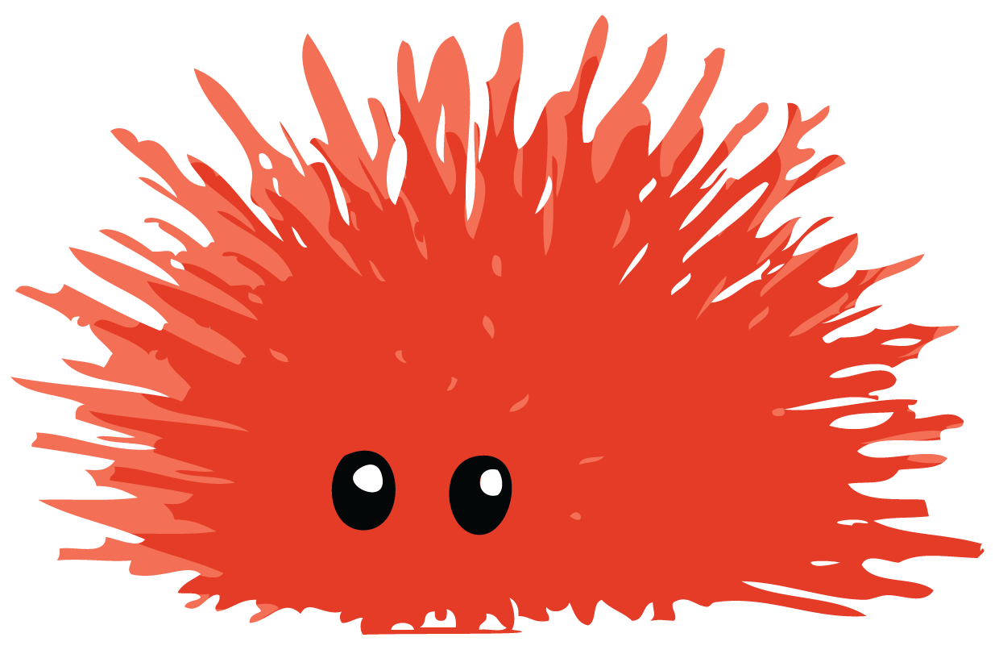

= Rust 2019
Алексей Кладов <aleksey.kladov@gmail.com>
:icons: font
:lecture: Лекция 11: unsafe
:table-caption!:
:example-caption!:

== !

[.centered]
== !

.В любом языке нужны низкоуровневые, "системные" операции:
* взаимодействие с OS
* управление памятью
* быстрые коллекции

[.centered]
== Где Живёт Интересный Код?

* в runtime языка (Go) / C-расширениях (Python)

.Нужно убедится, что расширение:
. даёт правильный результат при правильном использовании
. даёт ошибку при неправильном использовании (нет UB)

---

* написан на самом языке (C/C++)

Язык должен быть достаточно низкоуровневым, сложно отделить "runtime" от
бизнесс-логики

== Rust

В Rust [.language-rust]`unsafe` выполняет роль C-расширений

.Ядро языка:

* [.language-rust]`*const T`, [.language-rust]`*mut T` (разыменовывание -- [.language-rust]`unsafe`)
* [.language-rust]`extern "C" fn malloc(usize);` (вызов -- [.language-rust]`unsafe`)
* [.language-rust]`&T`, [.language-rust]`&mut T`, move semantics, alias analysis

.Стандартная библиотека:

* `Box`, `Vec`, `HashMap`
* `stdio`, `println!`

== Rust

[.language-rust]`unsafe` это "эффект": [.language-rust]`unsafe` операцию можно
выполнить только из [.language-rust]`unsafe` функции

Внутри safe функции можно написать [.language-rust]`unsafe` блок, но нужно
гарантировать, что не возникнет UB

https://journal.stuffwithstuff.com/2015/02/01/what-color-is-your-function/

== unsafe операции

. разыменование сырого указателя
. вызов [.language-rust]`unsafe` функции
. [.language-rust]`impl` для [.language-rust]`unsafe trait`
. доступ к [.language-rust]`static mut`
. доступ к полям [.language-rust]`union`

== UB

. разыменование висящего/нулевого указателя
. чтение не инициализированной памяти
. нарушение правил алиасинга (создание перекрывающихся [.language-rust]`&mut`)
. создание невалидных примитивных значений: нулевые/висящие ссылки, нулевые
указатели на функцию,
    [.language-rust]`bool` отличный от 0 или 1, невалидный вариант
    [.language-rust]`enum`, невалидный [.language-rust]`char` (например,
    одиночный суррогат), не UTF-8 `str`
. разматывание стэка через FFI
. гонка данных

[.centered]
== Центральное Обещание Rust

[.lead]
Используя систему типов, можно писать safe функции, вызывающие внутри
[.language-rust]`unsafe` операции, но **гарантирующие** отсутствие UB для любых
значений параметров

[.lead]
[.language-rust]`unsafe` это не инструмент выхода за пределы языка, это основание!

== Пример

[source,rust]
----
fn get_pair_mut<T>(
    xs: &mut [T],
    idx1: usize,
    idx2: usize,
) -> (&mut T, &mut T)
----

Функция `get_pair_mut` принимает массив, пару индексов и возвращает уникальные
ссылки на соответсвующие элементы

== Пример

[source,rust]
----
include::code/get_pair_mut.rs[]
----

Вызов `get_pair_mut` с **любыми** `idx1` и `idx2` не может вызвать UB (но может привести к панике)

== Пример

[source,rust]
----
/// Safety:
/// idx1 and idx2 must not be equal
unsafe fn get_pair_mut<T>(
    xs: &mut [T],
    idx1: usize,
    idx2: usize,
) -> (&mut T, &mut T) {

    let x1: *mut T = &mut xs[idx1];
    let x2: *mut T = &mut xs[idx2];

    (&mut *x1, &mut *x2)
}
----

`assert` убрать можно, но тогда мы **обязаны** пометить функцию как [.language-rust]`unsafe`

== Пример

[source,rust]
----
include::code/get_pair_mut2.rs[]
----

TIP: Написав одну функцию с [.language-rust]`unsafe` (`split_at_mut`), другие можно
выразить через неё, и получить memory safety бесплатно

== Параметризованные функции

[source,rust]
----
impl<T> [T] {
    fn sort(&mut self)
    where
        T: Ord,
}
----

Функция `sort` может использовать [.language-rust]`unsafe` внутри (например,
чтобы убрать проверку выхода за границу массива)

Для любых `T`, `sort` должна гарантировать отсутствие UB (потому что не помечена
[.language-rust]`unsafe`)

NOTE: Даже если реализация `T: Ord` не корректна (например, нет транзитивности),
UB возникнуть не должно!

[.centered]
== Параметризованные функции

Для сравнения, В C++ вызов `std::sort` для типа с не-транзитивным `<` это UB (и
может привести к выходу за границу массива на практике)

Баг в `+<=>+` в modern C++ может привести к UB: весь код `unsafe`

В Rust [.language-rust]`unsafe` позволяет установить **границы** возможного UB

== Параметризованные функции

Возможные альтернативы:

[source,rust]
----
impl<T> [T] {
    /// Safety:
    /// Ord must be a correct total order for T
    unsafe fn sort_faster(&mut self)
    where
        T: Ord,
}
----

Проверка контракта -- задача вызывающего `sort_faster`

== Параметризованные функции

Возможные альтернативы:

[source,rust]
----
/// Safety:
/// Implementors guarantee that Ord is a correct total order
unsafe trait TrustedOrd: Ord {}

impl<T> [T] {
    fn sort_faster(&mut self)
    where
        T: TrustedOrd,
}
----

Проверка контракта -- задача автора типа `T`

== Send & Sync

Send и Sync -- интересные [.language-rust]`unsafe trait`

Автор [.language-rust]`unsafe impl Sync for T` обязан гарантировать отсутствие
гонок данных

В большинстве случаев автор -- компилятор

Если все компоненты типа `Sync`, то сам тип тривиально `Sync`

[.title-slide]
== Напишем std

[.centered]
== Show Me the Code

https://github.com/rust-lang/rust/blob/bfb443eb1de484fde141fa9090a9f4291cbe60a5/

Нас будет интересовать `src/libcore`

== `[T]`

.`libcore/slice/mod.rs`:
[source,rust]
----
#[repr(C)]
struct FatPtr<T> {
    data: *const T,
    len: usize,
}
----

`FatPtr` -- представление `&[T]` в runtime: пара из указателя и длины

== `[T]`

.`libcore/slice/mod.rs`:
[source,rust]
----
#[repr(C)]
union Repr<'a, T: 'a> {
    rust: &'a [T],
    rust_mut: &'a mut [T],
    raw: FatPtr<T>,
}
----

C-style, [.language-rust]`unsafe` union: содержит одно из полей, без тэга

Доступ к полю [.language-rust]`union` -- [.language-rust]`unsafe` операция

Изначально исключительно для FFI, но нашёл применение в [.language-rust]`unsafe` коде

В данном случае: способ получить `FatPtr<T>` из `&T`

== `[T]`

[source,rust]
----
#[repr(C)]
union Repr<'a, T: 'a> {
    rust: &'a [T],
    rust_mut: &'a mut [T],
    raw: FatPtr<T>,
}

impl<T> [T] {
    pub const fn len(&self) -> usize {
        unsafe {
            Repr { rust: self }  // <1>
                .raw             // <2>
                .len
        }
}
----

<1> скоструировали `Repr` из `[T]`
<2> получили `FatPtr<T>`

== !

[source,rust]
----
use std::mem::{size_of, align_of};

pub unsafe fn from_raw_parts<'a, T>(
    data: *const T,
    len: usize,
) -> &'a [T] {
    debug_assert!(
        data as usize % align_of::<T>() == 0,
        "attempt to create unaligned slice",
    );
    debug_assert!(
        size_of::<T>().saturating_mul(len) <= isize::MAX as usize,
        "attempt to create slice covering half the address space",
    );
    Repr { raw: FatPtr { data, len } }.rust
}
----

Констуктор слайсов: сделали `FatPtr<T>`, посмотрели как на `&[T]`

== `[T]`

Немного компиляторной магии для синтаксиса `[T]`, в остальном библиотечный код

Представление -- `+repr(C)+` структура

Каст между `&[T]` и `FatPtr<T>` через [.language-rust]`union`

Знаем, что слайсы представленны как `FatPtr<T>`, потому что так работают
`from_raw_parts` и `from_raw_parts_mut`

== `[T]`

[source,rust]
----
impl<T> [T] {
    pub const fn as_ptr(&self) -> *const T {
        self as *const [T] as *const T // <1>
    }
}
----

<1> получить указатель можно без [.language-rust]`unsafe` (тоже магия компилятора)!

== `[T]`

[source,rust]
----
pub fn get<I: SliceIndex<Self>>(&self, index: I)
    -> Option<&I::Output>
{
    index.get(self)
}

pub fn get_mut<I: SliceIndex<Self>>(&mut self, index: I)
    -> Option<&mut I::Output>
{
    index.get_mut(self)
}
----

Индексация -- через вспомогательный трейт `SliceIndex`, чтобы работали `.get(0)`
и `.get(0..10)`

== !

[source,rust]
----
impl<T> SliceIndex<[T]> for usize {
    type Output = T;
    fn get(self, slice: &[T]) -> Option<&T> {
        if self < slice.len() {
            unsafe { Some(self.get_unchecked(slice)) }
        } else {
            None
        }
    }
    unsafe fn get_unchecked(self, slice: &[T]) -> &T {
        &*slice.as_ptr().add(self)
    }
}

impl<T: ?Sized> *const T {
    pub unsafe fn add(self, count: usize) -> Self where T: Sized
}
----

[.language-rust]`<*const T>::add` [.language-rust]`unsafe` -- указатель должен быть in-bounds

== !

[source,rust]
----
impl<T> SliceIndex<[T]> for ops::Range<usize> {
    type Output = [T];

    fn get(self, slice: &[T]) -> Option<&[T]> {
        if self.start > self.end || self.end > slice.len() {
            None
        } else {
            unsafe { Some(self.get_unchecked(slice)) }
        }
    }

    unsafe fn get_unchecked(self, slice: &[T]) -> &[T] {
        from_raw_parts(
            slice.as_ptr().add(self.start),
            self.end - self.start,
        )
    }
}
----

== split_at_mut

[source,rust]
----
pub fn split_at_mut(&mut self, mid: usize) -> (&mut [T], &mut [T]) {
    let len = self.len();
    let ptr = self.as_mut_ptr();

    unsafe {
        assert!(mid <= len);

        (from_raw_parts_mut(ptr, mid),
         from_raw_parts_mut(ptr.add(mid), len - mid))
    }
}
----

`assert` необходим!

== IterMut

[source,rust]
----
pub struct IterMut<'a, T: 'a>(&'a mut[T]);

impl<'a, T> Iterator for IterMut<'a, T> {
    type Item = &'a mut T; // <1>

    fn next(&mut self) -> Option<&'a mut T> {

        if self.0.is_empty() { return None; }

        let (l, r) = self.0.split_at_mut(1);
        self.0 = r;
        l.get_mut(0)
    }
}
----

<1> Магия! Повторные вызовы `next` гарантируют непересекающиеся
[.language-rust]`&mut` ссылки

== IterMut

[source,rust]
----
pub struct IterMut<'a, T: 'a>(&'a mut[T]);

impl<'a, T> Iterator for IterMut<'a, T> {
    type Item = &'a mut T;

    fn next(&mut self) -> Option<&'a mut T> {

        if self.0.is_empty() { return None; }

        let (l, r) = self.0.split_at_mut(1); // <1>
        self.0 = r;
        l.get_mut(0)
    }
}
----

<1> reborrowing, потому что не можем сделать move из поля [.language-rust]`&mut` значения :-(

== swap trick

[source,rust]
----
pub struct IterMut<'a, T: 'a>(&'a mut[T]);

impl<'a, T> Iterator for IterMut<'a, T> {
    type Item = &'a mut T;

    fn next(&mut self) -> Option<&'a mut T> {
        let slice = std::mem::replace(&mut self.0, &mut []);
        if slice.is_empty() { return None; }

        let (l, r) = slice.split_at_mut(1);
        self.0 = r;
        l.get_mut(0)
    }
}
----

[.centered]
== swap trick

В реальности `IterMut` устроен по другому -- как пара указателей

[.centered]
== !

[source,rust,subs="+quotes"]
----
struct IterMut<[.hl-error]##'a##, T> { // unused type parameter
    begin: *mut T,
    end: *mut T,
}
----

[.title-slide]
== Variance

== Subtyping

В Rust есть отношение "быть подтипом" на временах жизни:

[source,rust]
----
'a: 'b
----

Читается как [.language-rust]`'a` outlives [.language-rust]`'b`

[.language-rust]`&'a T` это подтип [.language-rust]`&'b T` -- сокращение вж не
нарушает memory safety

== !

[source,rust]
----
fn min<'a>(xs: &Vec<'a str>, default: &'a str) -> &'a str {
    ...
}

fn main() {
    let xs: Vec<'static str> = vec!["hello", "world"];
    let local: String = "spam".to_string()
    let m = min(&xs, local.as_str())
}
----

Из [.language-rust]`Vec<&'static str>` и [.language-rust]`&'a str` можно выбрать [.language-rust]`&'a str`

Так как [.language-rust]`&'static str <: &'a str` +
то [.language-rust]`Vec<'static str> <: Vec<'a str>`

NOTE: `Vec<T>` ковариантен по `T`

== !

[source,rust]
----
include::code/evil.rs[]
----

== !

[source,rust,subs="+quotes"]
----
fn assign_ref<'a>(r: &mut &'a str, s: &'a str) {
    *r = s
}

fn evil(r: &mut &'static str) {
    let local: String = "spam".to_string();
    let local: &str = [.hl-error]##local##.as_str();
    assign_ref(r, local)
}

fn main() {
    let mut hello: &'static str = "hello";
    evil(&mut hello);
    println!("{}", hello);
}
----

NOTE: `&'a mut T` инвариантна по `T`

== !

[cols="2,6",grid=none,frame=none]
|===
|[.language-rust]`T`| ковариантность
|[.language-rust]`&'a T`| ковариантность по [.language-rust]`'a` и `T`
|[.language-rust]`&'a mut T`| ковариантность по [.language-rust]`'a`, инвариатность по `T`
|[.language-rust]`*const T`| ковариантность
|[.language-rust]`*mut T`| инвариантность
|[.language-rust]`fn(T)`| **контр**вариантность
|[.language-rust]`+fn() -> T+`| ковариантность
|[.language-rust]`+fn(T) -> T+`| инвариантность
|[.language-rust]`Cell<&'a T>`| инвариантность
|===

[.centered]
== !

Единственная разница между [.language-rust]`*const T` и [.language-rust]`*mut T`
-- variance

И [.language-rust]`&'a T`, и [.language-rust]`&'a mut T` ковариантны по [.language-rust]`'a`

[.centered]
== PhantomData

[source,rust]
----
struct S<'a, T> {
    ...
}
----

[NOTE.question]
Как определить вариантность по [.language-rust]`'a` и `T`?

[.invisible]
Автоматически, из определения `S`

[.centered]
== PhantomData

[source,rust]
----
struct S<'a, T> {
    xs: &'a mut Vec<T>,
}
----

[NOTE.question]
Как определить вариантность по [.language-rust]`'a` и `T`?

Автоматически, из определения `S`

== PhantomData

Если параметр типа не используется, то нельзя определить вариантность => все
параметры должны использоваться

`PhantomData<T>`::
Магический ZST тип, который ведёт себя как `T` с точки зрения variance и dropcheck

[.two-col]
--
[source,rust]
----
struct A<'a, T> {
    value: T,
    r: &'a ()
}
----

[source,rust]
----
struct B<'a, T> {
    value: &'a T,

}
----
--

`A` вызывает деструктор `T`, `B` нет

== !

[source,rust]
----
include::code/phantom.rs[lines=1..20]
----

[.centered]
== !

[source,rust]
----
include::code/phantom.rs[lines=22..]
----

== `NonNull<T>`

Для написания структур данных часто нужен ковариантный указатель, из которого
удобно получать [.language-rust]`&mut T`

`std::ptr::NonNull<T>` -- как раз такой тип

[source,rust]
----
size_of::<Option<NonNull<T>>>()
    == size_of::<NonNull<T>>()
----

== !

[source,rust]
----
#[rustc_layout_scalar_valid_range_start(1)]
pub struct NonNull<T: ?Sized> {
    pointer: *const T,
}
impl<T: ?Sized> NonNull<T> {
    pub const unsafe fn new_unchecked(ptr: *mut T) -> Self {
        NonNull { pointer: ptr as _ }
    }
    pub fn new(ptr: *mut T) -> Option<Self> {
        if !ptr.is_null() {
            Some(unsafe { Self::new_unchecked(ptr) })
        } else {
            None
        }
    }
    pub const fn as_ptr(self) -> *mut T {
        self.pointer as *mut T
    }
    pub unsafe fn as_mut(&mut self) -> &mut T {
        &mut *self.as_ptr()
    }
}
----
